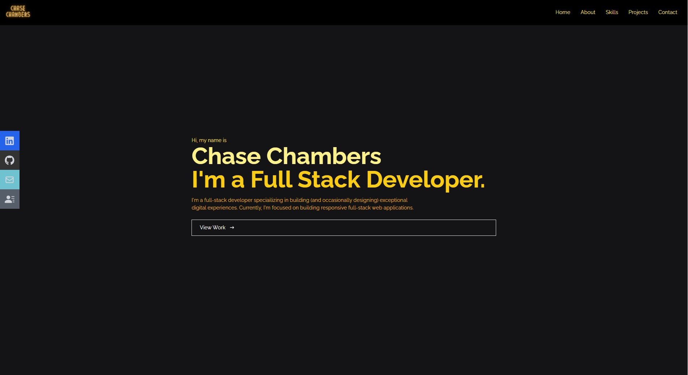

My React Portfolio

## Badges

## Description

This project allows you to type notes, and saves the notes in the system database so you can return to them.

## Table of Contents

- [Description](#description)
- [Installation](#installation)
- [Usage](#usage)
- [Credits](#credits)
- [License](#license)
- [Badges](#badges)
- [Features](#features)
- [Tests](#tests)
- [Questions](#questions)

## Installation

You can view my portfolio by going to https://chasechambers.github.io/fullstack-portfolio/

## Usage

## Credits

Class work, AskBCS, design helped by Nancy Chambers, template and beginning code from youtuber Code Commerce

## License

This project is covered under the MIT License

## Features

This site allows people to contact me, view my resume/Github/Linkedin, or view some of my recent projects.

## How to Contribute

N/A

## Tests

Any links or just contacting me

## Questions

https://github.com/chasechambers

I can be reached via e-mail at:
chambers.chase@gmail.com
